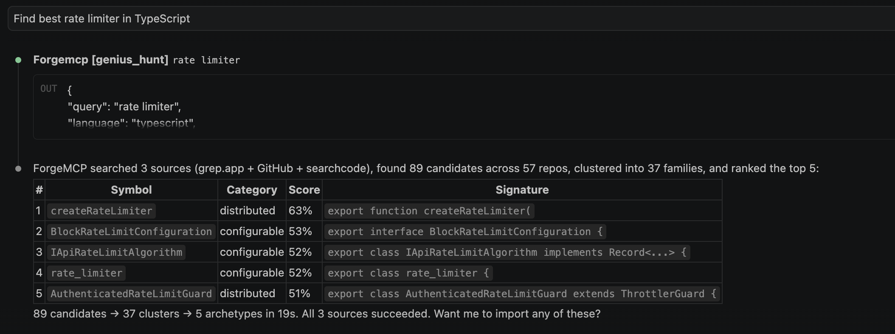
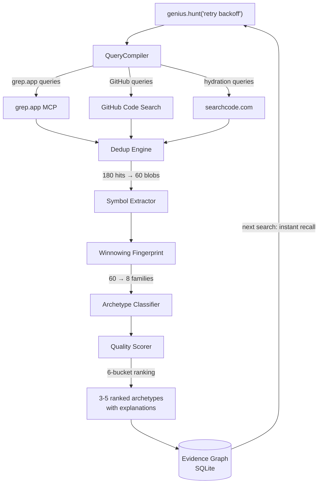

<div align="center">

# 🔥 GeniusMCP

**Quality-aware code intelligence that turns GitHub search into ranked, explainable, import-ready recommendations.**

[](https://nodejs.org)
[](#testing)
[](LICENSE)
[](https://modelcontextprotocol.io)

<br/>

**Not another grep. An intelligence layer.**

[Quick Start](#-quick-start) · [How It Works](#-how-it-works) · [Soul](soul.md) · [Tools](#%EF%B8%8F-tools-28-mcp-tools) · [Architecture](#%EF%B8%8F-architecture)



</div>

---

## The Problem

Every code search tool answers **"where is this string?"**

None of them answer **"what is the _best_ implementation, why, and can I safely use it?"**

When you ask `genius.hunt("retry with backoff")`, GeniusMCP returns:

```
Archetype 1 — Minimal inline helper
  ✅ 12 LOC, zero deps, copy-paste ready
  Exemplar: owner/repo — score 0.87 (battle_tested)
  Why: test-adjacent, MIT license, 3 years stable

Archetype 2 — Configurable utility
  ✅ Options-driven, max attempts + jitter strategy
  Exemplar: owner/repo2 — score 0.82
  Why: 14K stars, active maintenance, comprehensive docs

Archetype 3 — Middleware pattern
  ✅ Express/Fastify compatible, interceptor-based
  Exemplar: owner/repo3 — score 0.79
  Tradeoff: framework-coupled

Coverage: 3 sources searched, 2 blind spots, confidence: 0.83
```

**That's the gap GeniusMCP fills.**

---

## ✨ Key Features

| Feature | What it does |
|---------|-------------|
| **🎯 Archetype Search** | Finds 3-5 structural families, not 200 raw matches |
| **📊 6-Bucket Quality Scoring** | queryFit · durability · vitality · importability · codeQuality · evidenceConfidence |
| **🔍 Multi-Source Discovery** | grep.app (free, 1M repos) + GitHub Code Search (200M repos) + searchcode (75B lines) |
| **🧬 3-Level Dedup** | Exact SHA → normalized AST hash → winnowing fingerprint families |
| **📜 Provenance-First Import** | License gate · dependency closure · policy checks · attribution |
| **🧠 Persistent Memory** | Every search enriches local evidence graph. Session 50 is smarter than session 1. |
| **🪝 Auto-Capture Hooks** | Claude Code hooks capture patterns from every file you read/write |
| **💉 Pre-Prompt Injection** | Relevant memories injected BEFORE the AI responds |
| **🏗️ 7 Archetype Categories** | minimal · configurable · middleware · context-aware · distributed · enterprise · wrapper |
| **📋 Transparent Uncertainty** | Every result shows blind spots + evidence confidence |
| **⚡ Tiered Responses** | L1 (80 tokens) / L2 (300) / L3 (2000) — adaptive detail level per result count |
| **🛡️ Circuit Breakers** | Per-source fault isolation: GitHub/grep.app/searchcode fail independently |
| **🎰 Thompson Sampling** | Multi-armed bandit learns which sources produce best results per query type |
| **🔤 SAC Matching** | `getUserSession` finds `get_user_session` — cross-convention identifier similarity |
| **📦 Signature Compression** | Repomix-style 70% token reduction — strips bodies, keeps signatures |
| **🔍 Dynamic Discovery** | `forge_discover("search code")` — find tools by intent, not memorize 28 names |

---

## 🏆 Why GeniusMCP

| | GitHub MCP | grep.app MCP | DeusData | GeniusMCP |
|---|:---:|:---:|:---:|:---:|
| Multi-source search | 1 source | 1 source | local only | **3 sources** |
| Quality scoring | no | no | no | **6-bucket** |
| License verification | no | no | no | **yes** |
| Import with provenance | no | no | no | **yes** |
| Persistent memory | no | no | knowledge graph | **Bayesian + decay** |
| Cross-convention matching | no | no | no | **SAC algorithm** |
| Fault tolerance | no | no | no | **circuit breakers** |
| Token efficiency | no | no | no | **L1/L2/L3 tiers** |

---

## 🚀 Quick Start

```bash
# 1. Clone and install
git clone https://github.com/geniussigmaskibidi-gif/geniusmcp
cd geniusmcp && pnpm install && pnpm build

# 2. Optional: GitHub auth (enables GitHub Code Search + metadata)
export GITHUB_TOKEN=ghp_your_token
```

### Add to Claude Code (`.mcp.json` in your project root)

```json
{
  "mcpServers": {
    "forgemcp": {
      "command": "node",
      "args": ["/path/to/forgemcp/apps/mcp-server/dist/index.js"],
      "env": { "GITHUB_TOKEN": "ghp_your_token" }
    }
  }
}
```

Server auto-indexes your project on start. `code.reach`, `code.map`, `code.symbols` work immediately.

### Optional: Claude Code Hooks (auto-capture + injection)

```json
{
  "hooks": {
    "PostToolUse": [
      { "matcher": "Read|Write|Edit", "command": "node hooks/genius-capture.js" }
    ],
    "UserPromptSubmit": [
      { "command": "node hooks/genius-inject.js" }
    ]
  }
}
```

---

## 💡 Usage Examples

### Find the best implementation of a concept
```
You: "Find me a good rate limiter implementation"
Agent calls: genius.hunt("rate limiter", language: "typescript", tier: "L1")
→ 5 ranked archetypes in 130 tokens, with stars/license/test signals
```

### Import code with license verification
```
You: "Import that circuit breaker from the best result"
Agent calls: import.extract("owner/repo", "src/circuit-breaker.ts", symbol: "CircuitBreaker")
→ Full code + MIT license verified + provenance hash + attribution comment
```

### Compare approaches across repos
```
You: "Should I use Zod or Ajv for validation?"
Agent calls: research.deep_compare("validation", ["colinhacks/zod", "ajv-validator/ajv"])
→ Side-by-side: Zod 42K stars vs Ajv 14K, both MIT+CI, structured quality signals
```

### Remember and recall across sessions
```
Session 1: genius.hunt("retry backoff") → auto-stores top 3 results
Session 2: memory.recall("retry") → instant recall, no API calls needed
```

### Explore unfamiliar repository
```
You: "How does Hono handle errors?"
Agent calls: research.archaeology("honojs/hono", "error handling")
→ Found .onError() handler, JWT error middleware, 29K stars, TypeScript
```

> **Read [soul.md](soul.md) for the complete AI agent reasoning guide — search strategies, anti-patterns, and token budget optimization.**

---

## 🔄 How It Works



### The Magic Loop

```
Session 1: "Find best rate limiter" → searches 3 sources → 60 unique blobs → 5 archetypes
           → Results cached in evidence graph

Session 2: "Rate limiter for Express" → local memory: 40 instant hits + 20 new
           → Faster, smarter, more relevant

Session 10: "Throttle middleware" → 120 cached patterns, <100ms response
            → Compound intelligence
```

---

## 🛠️ Tools (28 MCP Tools)

### 🎯 Hunt Intelligence (flagship)

| Tool | Description |
|------|------------|
| `genius.hunt` | Find best implementations with archetype clustering, quality scoring, coverage report |
| `genius.explain` | Full signal breakdown: why this ranked #1 |
| `genius.compare` | Head-to-head comparison with bucket deltas |
| `genius.import` | Policy-aware import with provenance manifest |

### 🧠 Memory (compound intelligence)

| Tool | Description |
|------|------------|
| `memory.recall` | Search past patterns by concept |
| `memory.store` | Save pattern to persistent memory |
| `memory.evolve` | Create improved version linked to parent |
| `memory.related` | Find connected patterns |
| `memory.link` | Create relationships between patterns |
| `memory.stats` | Memory size, coverage, confidence distribution |
| `memory.forget` | Remove outdated patterns |

### 🧭 Code Navigation (1 call = 10 Read/Greps)

| Tool | Description |
|------|------------|
| `code.reach` | Jump to symbol with full context: callers, callees, deps |
| `code.map` | Instant project architecture map |
| `code.trace` | Call chain between functions |
| `code.understand` | Compressed module understanding |
| `code.symbols` | All exports with signatures |

### 🔬 Research (persistent reasoning chains)

| Tool | Description |
|------|------------|
| `research.archaeology` | Trace code evolution |
| `research.deep_compare` | Structured comparison with metrics |
| `research.start_chain` | Begin research thread |
| `research.add_step` | Record reasoning step |
| `research.conclude` | Mark chain completed |
| `research.recall_chain` | Search past research |

### 🐙 GitHub

| Tool | Description |
|------|------------|
| `github.search_repos` | Search by query, language, stars |
| `github.search_code` | Code search across GitHub |
| `github.repo_overview` | Stars, CI, license, health |
| `github.repo_file` | Get file content |
| `github.repo_tree` | Recursive file tree |

---

## 🏗️ Architecture

```
┌─────────────────────────────────────────────────────┐
│                   GeniusMCP Server                   │
│                                                     │
│  Layer 1: DISCOVERY                                 │
│    grep.app MCP · GitHub Code Search API            │
│                                                     │
│  Layer 2: HYDRATION                                 │
│    GitHub Trees/Contents · searchcode analysis      │
│                                                     │
│  Layer 3: EVIDENCE GRAPH                            │
│    SourceHit → Blob → SymbolSlice → PatternFamily   │
│                                                     │
│  Layer 4: PATTERN INTELLIGENCE                      │
│    3-level dedup · archetype classifier · scorer    │
│                                                     │
│  Layer 5: IMPORT & POLICY                           │
│    License gate · provenance · dep closure          │
│                                                     │
│  Layer 6: EVALUATION                                │
│    Coverage confidence · blind spots · metrics      │
└─────────────────────────────────────────────────────┘
```

### Quality Scoring (RFC v2)

```
overall = 0.35 × queryFit + 0.50 × qualityComposite + 0.15 × evidenceConfidence

qualityComposite = weights[preset] × {durability, vitality, importability, codeQuality}
```

**Presets:** `battle_tested` · `modern_active` · `minimal_dependency` · `teaching_quality`

**Hard caps:** `snippet_only` → evidence ≤ 0.60 · `archived` → vitality ≤ 0.20 · `license_unknown` → importability ≤ 0.20

---

## 📦 Monorepo Structure

```
forgemcp/
  packages/
    core/              — Types, config, errors (Zod-validated)
    db/                — SQLite WAL, blob store, search index, evidence graph
    ast-intelligence/  — Symbol extraction, call graph, architecture detection
    repo-memory/       — Bayesian confidence + Ebbinghaus decay engine
    github-gateway/    — Octokit + 4-bucket rate governor + ETag cache
    data-sources/      — grep.app + searchcode + source orchestrator
    hunt-engine/       — Winnowing, clustering, scoring, archetype classifier
    importer/          — License policy + provenance + style adaptation
  apps/
    mcp-server/        — MCP server + 5 skill modules + hook daemon + dynamic tools
  hooks/               — Claude Code auto-capture scripts
  tests/               — 252 tests (vitest)
  .github/workflows/   — CI (Node 20/22, build + typecheck + test)
```

---

## 🧪 Testing

```bash
npx vitest run
# 22 test suites, 252 tests, all passing (<1s)
```

| Suite | Tests | What it covers |
|-------|-------|---------------|
| foundation | 19 | ForgeResult, Logger, Health, Context |
| blob-store | 10 | Content-addressable storage, dedup, file refs |
| blob-lifecycle | 11 | GC, pinning, integrity scrub |
| symbol-extractor | 13 | TypeScript, Python, Go extraction + fingerprinting |
| parser-registry | 6 | Multi-backend precision routing |
| search-index | 4 | FTS5 trigram, BM25, RRF fusion |
| simhash | 14 | Near-duplicate detection, Hamming distance |
| chunker | 8 | Semantic code chunking, symbol boundaries |
| query-planner | 14 | Query classification, lane planning |
| ranking-v2 | 13 | BM25F weights, retrieval scoring, lexical+structural |
| memory-engine | 15 | Store, recall, capture, Bayesian confidence, Ebbinghaus decay |
| memory-v2 | 6 | L1/L2/L3 capsule builder, token estimation |
| call-graph | 9 | 2-pass resolution, BFS reachability, path tracing |
| winnowing | 12 | Fingerprints, Jaccard similarity, clone clustering |
| policy-engine | 11 | 4-mode import policy, license gates, provenance |
| evidence-graph | 8 | v2 schema: query runs, slices, families, versioned scores |
| job-queue | 10 | Durable job queue, priority, backoff, dead-letter |
| circuit-breaker | 19 | Circuit breaker state machine, bulkhead, resilient search |
| token-budget | 22 | Token estimation, tier selection, truncation, compression |
| source-selector | 5 | Thompson Sampling, convergence, discounting |
| early-terminator | 6 | Welford online stats, adaptive saturation |
| sac | 17 | Subword Affine Canonicalization, cross-convention matching |

---

## 🎯 Design Principles

1. **Evidence, not opinions** — every score has signals you can inspect
2. **Local-first** — works offline for indexed repos
3. **Zero ML in core** — lexical + structural, semantic is opt-in
4. **Provenance always** — every import traced to source + license
5. **Progressive learning** — every search enriches the evidence graph
6. **Transparent uncertainty** — blind spots shown, not hidden

---

## 📊 Tech Stack

| Component | Technology |
|-----------|-----------|
| Protocol | MCP SDK 1.28 (stdio + Streamable HTTP) |
| Database | SQLite (WAL mode, better-sqlite3) |
| Search | FTS5 trigram + BM25F + Reciprocal Rank Fusion |
| AST | Regex multi-language + ast-grep upgrade path |
| Dedup | Winnowing fingerprints (Schleimer 2003) + Jaccard clustering |
| GitHub | Octokit + throttling + retry + 4-bucket rate governor |
| External | grep.app MCP + searchcode.com |
| Validation | Zod |
| Resilience | Circuit breakers + bulkheads + decorrelated jitter |
| Ranking | SAC cross-convention matching + Thompson Sampling source routing |
| Token Efficiency | L1/L2/L3 tiered responses + signature compression |
| Tests | Vitest (252 tests, <1s) |
| Monorepo | pnpm + Turborepo |

---

## 📄 License

MIT

---

<div align="center">

**Built for AI agents that never forget.**

[Report Bug](../../issues) · [Request Feature](../../issues) · [Discussions](../../discussions)

</div>
